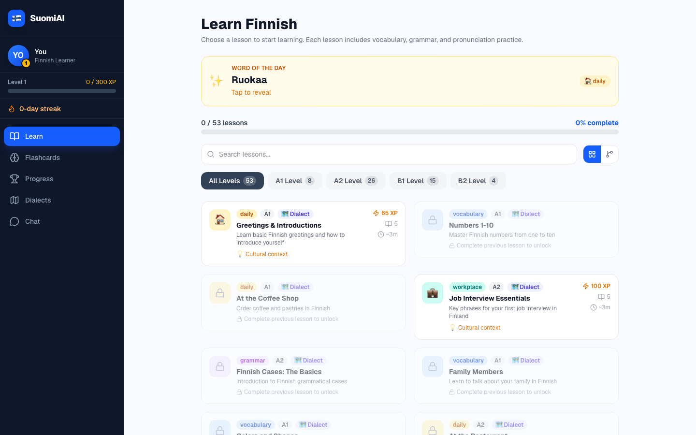
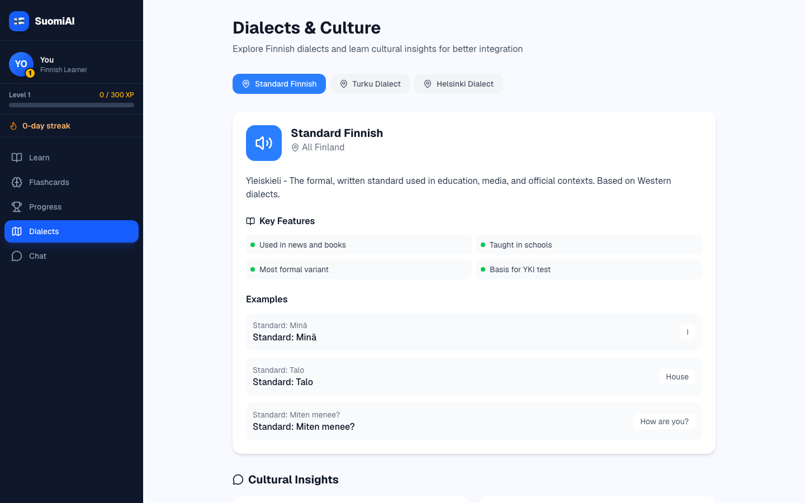
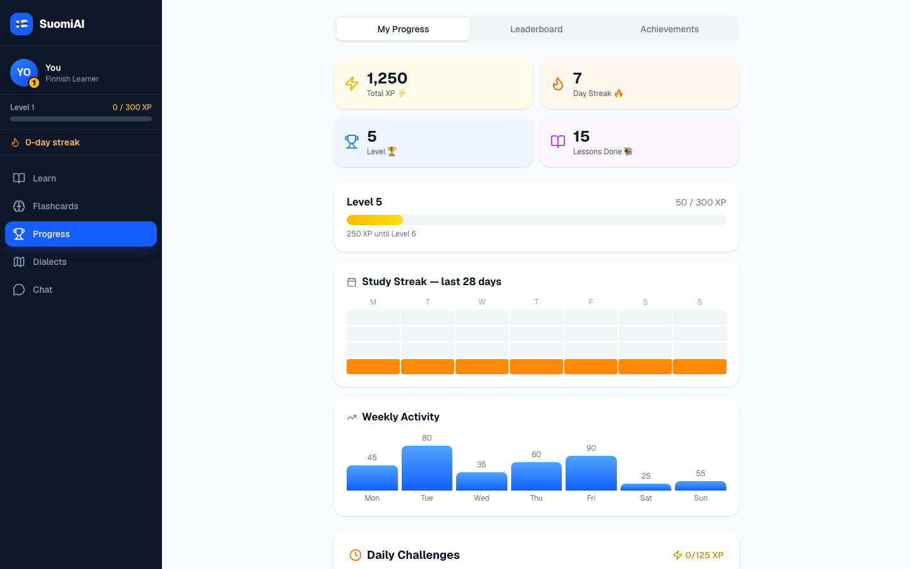
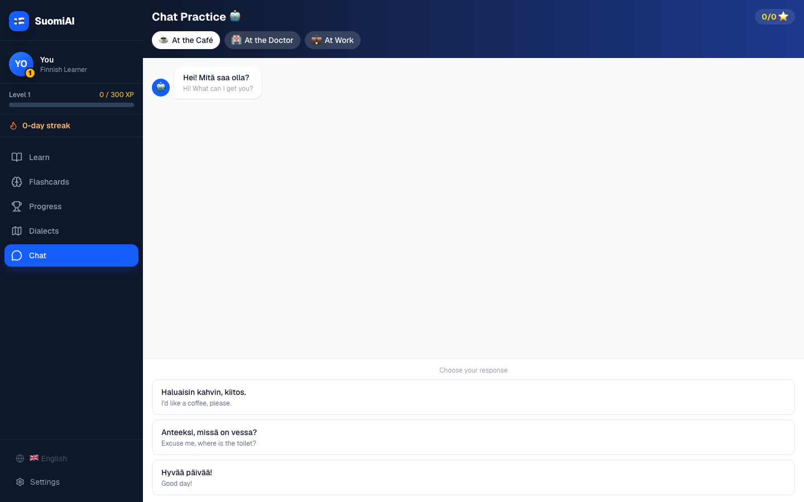

# SuomiAI — Finnish Language Learning for Life in Finland

> AI-powered Finnish practice for immigrants and new residents: lessons, pronunciation, dialects, culture, and job-ready conversation practice.

**Live demo:** [suomi-ai-tutor.vercel.app](https://suomi-ai-tutor.vercel.app)  
**Release:** [v0.1.0](https://github.com/mzunain/suomi-ai-tutor/releases/tag/v0.1.0)



## Why This Exists

Finnish is unusually hard for generic language apps: 15 grammatical cases, long agglutinative words, vowel harmony, and real dialect differences between places like Turku and Helsinki. For immigrants in Finland, language learning is not just vocabulary practice. It is job interviews, healthcare visits, workplace small talk, and understanding local culture.

SuomiAI focuses on that exact gap: practical Finnish for integration, with AI-assisted pronunciation practice and local context instead of generic flashcards.

## Product Highlights

| Area | What is included |
|---|---|
| Lesson system | 53 lessons across A1-B2, search, level filters, lesson locks, word of the day |
| Pronunciation | Browser recording flow, Finnish TTS playback, pronunciation scoring API route |
| Dialects | Standard Finnish, Turku dialect, Helsinki slang, regional examples, cultural notes |
| Practice | Scenario-based chat for cafe, doctor, and workplace conversations |
| Retention | SM-2 flashcards, XP, levels, streaks, achievements, daily challenges |
| Accessibility | 8-language UI: English, Finnish, Swedish, Arabic, Russian, Persian, Turkish, Somali |
| Deployment | Next.js 16 App Router, Tailwind CSS v4, Vercel CI/CD |

## Screenshots

| Lessons | Dialects |
|---|---|
|  |  |

| Progress | Chat Practice |
|---|---|
|  |  |

## Direct Demo Links

- [Lesson library](https://suomi-ai-tutor.vercel.app/?view=lessons)
- [Progress dashboard](https://suomi-ai-tutor.vercel.app/?view=progress)
- [Dialects and culture](https://suomi-ai-tutor.vercel.app/?view=dialects)
- [Chat practice](https://suomi-ai-tutor.vercel.app/?view=chat)

## Tech Stack

- **Framework:** Next.js 16.2.2, App Router, Turbopack
- **UI:** React 19, Tailwind CSS v4, framer-motion, lucide-react
- **AI/Speech:** OpenAI Whisper-ready pronunciation API, Web Speech API playback
- **Data:** Local-first progress storage, optional PostgreSQL via Prisma
- **Auth:** NextAuth-ready Google OAuth path
- **Deployment:** Vercel, Frankfurt `fra1`, GitHub Actions production deploys

## Getting Started

### Requirements

- Node.js >= 20.9.0
- npm 10+

### Run Locally

```bash
npm install --ignore-scripts
npm run dev
```

Open [http://localhost:3000](http://localhost:3000).

### Verify

```bash
npm run lint
npm run build
```

## Environment Variables

The app runs without environment variables. Database-backed features gracefully fall back to local/demo behavior.

To enable auth and cloud progress sync, create `.env.local`:

```env
DATABASE_URL=postgresql://...
NEXTAUTH_SECRET=your-secret-here
NEXTAUTH_URL=http://localhost:3000
GOOGLE_CLIENT_ID=...
GOOGLE_CLIENT_SECRET=...
```

## Project Structure

```text
src/
├── app/                    # Next.js App Router pages and API routes
├── components/
│   ├── chat/               # Scenario dialogue practice
│   ├── dialects/           # Dialect selector and cultural notes
│   ├── flashcards/         # SM-2 flashcards
│   ├── gamification/       # XP, streaks, leaderboard, achievements
│   ├── lessons/            # Lesson library and lesson player
│   ├── onboarding/         # Learner onboarding flow
│   └── ui/                 # Shared UI primitives
├── data/                   # Lessons and daily challenges
├── hooks/                  # Local storage and i18n hooks
└── lib/                    # Utilities and optional Prisma client
```

## Roadmap

| Status | Work |
|---|---|
| Done | Lesson library, lesson player, flashcards, gamification, dialects, chat practice |
| Done | Public repo polish: topics, live demo, release, screenshots, passing lint/build |
| In progress | Google OAuth and cloud progress sync |
| Next | Production Whisper scoring with real phoneme feedback |
| Next | Grammar drills for Finnish cases and verb conjugation |
| Future | Offline PWA mode and React Native / Expo mobile app |

## Contributing

See [CONTRIBUTING.md](CONTRIBUTING.md) for local setup, verification commands, and content guidelines.

## License

MIT — see [LICENSE](LICENSE).
